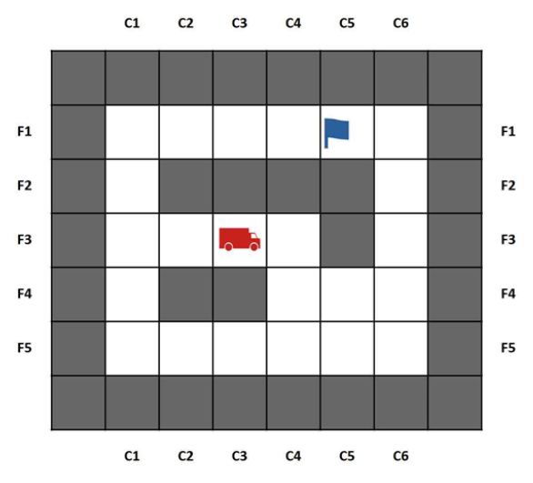

# Search algorithms for route planning in parcel delivery

## Objetivos
Se busca implementar y analizar distintos algoritmos de búsqueda aplicados a un problema de navegación en un entorno estructurado. Se busca:

- Comparar el rendimiento de algoritmos de búsqueda no informada (Búsqueda en amplitud - BFS, Búsqueda en profundidad - DFS).
- Evaluar el comportamiento de algoritmos de búsqueda informada como Costo Uniforme (UCS) y A* con diferentes heurísticas.
- Medir y analizar métricas como longitud del camino, costo total, nodos visitados e iteraciones.
- Visualizar los resultados mediante representaciones gráficas del entorno y los caminos generados.
- Determinar la eficiencia de cada enfoque en distintos escenarios, considerando restricciones del entorno y heurísticas utilizadas.

## Descripción del proyecto

El problema que se simula es una simplificación del que debe abordar una empresa de paquetería al organizar una serie de recogidas en distintos puntos de la ciudad. Para ello sus furgonetas automáticas tienen que ser capaces de encontrar caminos entre su ubicación y los puntos de recogida, y conocer el mapa de la ciudad.  

El proyecto consiste en utilizar varias estrategias de búsqueda con el fin de generar estos caminos de forma automática. 

Se simplifica el problema considerando el espacio dividido en una matriz rectangular, de modo que una furgoneta estará situada en una ubicación identificada por sus coordenadas. La furgoneta puede moverse en sentido horizontal y vertical. Las localizaciones se indican mediante filas y columnas. 

    

Posible situación de inicio del problema. El camión representa la posición inicial del agente y la bandera un lugar al que debe ir a recoger un paquete.

El mapa se representa mediante casillas ordenadas en una matriz e incluye paredes que no se pueden traspasar. Se define mediante una sintaxis muy sencilla donde cada símbolo representa un agente, un objetivo, una pared o bien espacio vacío.  

1. El estado inicial consiste en la posición inicial del agente y de las casillas donde hay paquete para recoger. El objetivo es recoger todos los paquetes. 

2. Las acciones permitidas son los movimientos de una casilla en dirección horizontal o vertical (no diagonal). 

3. El coste del movimiento de la furgoneta se configura mediante una variable y varía en los diversos casos de la actividad (ver código). 

4. El código proporcionado incorpora como heurística (para los algoritmos informados) una basada en la distancia de Manhattan. 

Se utilizan diferentes algoritmos:
- Búsqueda en Amplitud (BFS): Explora todos los nodos a un mismo nivel antes de profundizar.
- Búsqueda en Profundidad (DFS): Explora caminos completos antes de retroceder.
- Costo Uniforme (UCS - Dijkstra): Encuentra el camino de menor costo acumulativo.
- A*: Utiliza heurísticas para guiar la búsqueda y reducir el número de nodos explorados.

Las heurísticas implementadas incluyen:
- Distancia de Manhattan (suma de diferencias en coordenadas).
- Distancia de Chebyshev (máxima diferencia en coordenadas).
- Variaciones escaladas de Manhattan para influir en la exploración.

## Ejemplos de uso

A* usando el algoritmo 2:

    

A* usando el algoritmo 3:

    

## Tecnologías utilizadas

- Python → Lenguaje utilizado para implementar los algoritmos de búsqueda.
- SimpleAI → Implementación de algoritmos de búsqueda. (simpleai.search)
- Matplotlib → Para la visualización de los mapas y caminos encontrados.
- NumPy → Para manipulación y transformación de datos en matrices.
- Jupyter Notebook → Para ejecutar el código de forma interactiva.

**Algoritmos de búsqueda implementados:**
- Búsqueda en Amplitud (BFS - Breadth-First Search)
- Búsqueda en Profundidad (DFS - Depth-First Search)
- Costo Uniforme (UCS - Dijkstra)
- A* (A-Star) con distintas heurísticas
  - Distancia de Manhattan
  - Distancia de Chebyshev
  - Manhattan con pesos modificados
